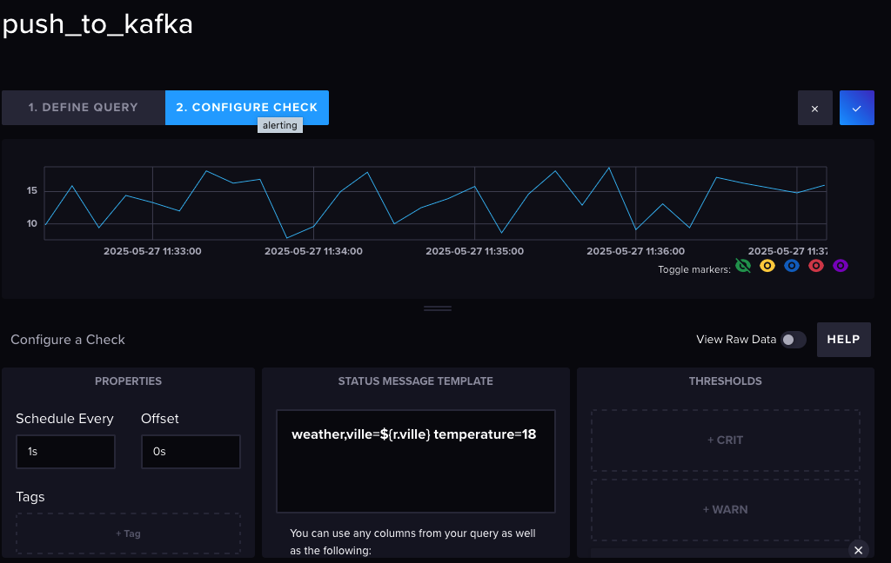
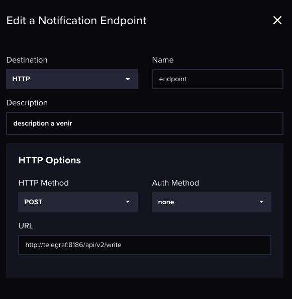
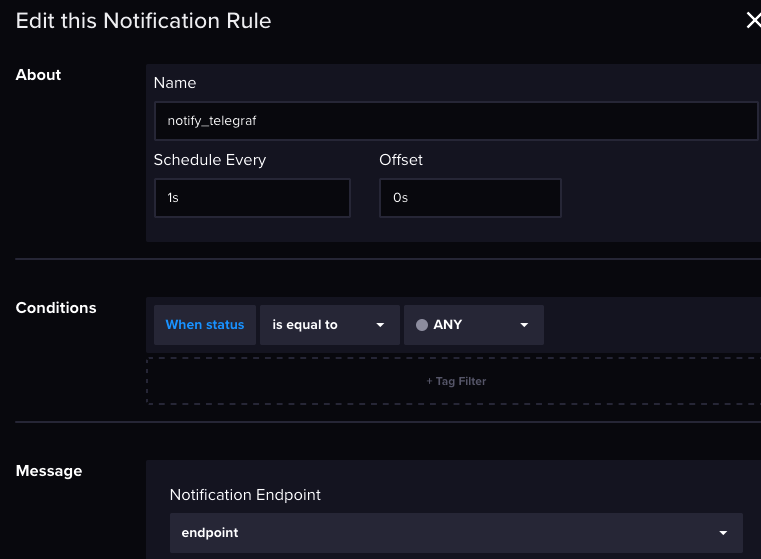

Objectif : un script envoie dans InfluxDB, un check est réalisé, la notification rule est activée pour finir par appeler un endpoint qui appel un producteur kafka


Etat des 









```pgsql
+----------------+
|  inject        |  ← Génère données météo simulées
|  (inject.py)   |
+-------+--------+
        |
        | InfluxDB Client API
        v
+----------------+
|  influxdb      |  ← Stocke les mesures (ville, température, timestamp)
+-------+--------+
        |
        | Flux Query API
        v
+----------------+
|  producer      |  ← Lit les nouvelles données dans InfluxDB
|  (producer.py) |     et les envoie vers Kafka (clé = ville)
+-------+--------+
        |
        | Kafka Protocol
        v
+----------------+
|  kafka[1..3]   |  ← Cluster KRaft, topic `weather` (4 partitions, RF=3)
+-------+--------+
        |
        | HTTP REST
        v
+----------------+
|  kafdrop       |  ← UI pour inspecter le cluster, les topics, les messages
+----------------+
```